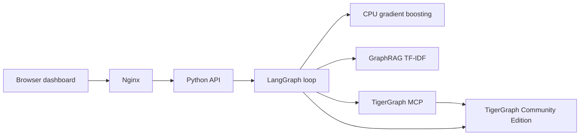
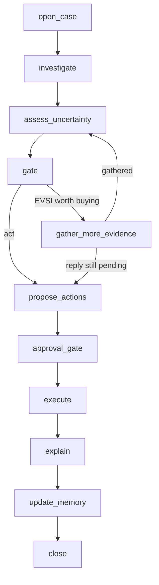

# An agent that can show its fraud evidence

*Sumora's submission for the TigerGraph Agentic Fraud Investigation task at Hacker House Goa.*

[Source and 20 answer files](https://github.com/devanshranjan10/sumora-hhgoa-2026) ·
[Live investigator](http://34.66.141.236/) ·
[Demo](../demo/) ·
[YouTube](https://youtu.be/-eyAHKQIo4c)

Sumora investigates a payment-fraud alert on a live TigerGraph graph, estimates one fraud probability, and either asks for more evidence or recommends a policy action. The browser never opens the database. A Python API runs a LangGraph loop. That loop reads the graph through TigerGraph's official MCP server and through RESTPP, retrieves citable policy text, and writes the case back.

The hidden labels on the 20 scored cases are unavailable. The numbers below are historical holdout scores, graph census checks, and answer-contract checks. They are not a claim of challenge accuracy.

## What is running



| Component | Owns | Reads |
|---|---|---|
| `service/app.py` | HTTP cases, imports, health, run storage | `agent/`, the raw CSV index, TigerGraph |
| `agent/runner.py` | LangGraph state and the stopping decision | tools, the decision model, policy |
| `agent/decision_model.py` | Fraud probability and a calibration interval | `eval/overlap_model/candidate.joblib` and raw transaction fields |
| `agent/mcp_graph.py` | Installed pattern and similarity queries | [TigerGraph MCP](https://github.com/tigergraph/tigergraph-mcp) on loopback, tool `tigergraph__run_installed_query` only |
| `agent/tools.py` | Bounded graph reads and audited writes | MCP for selected reads; RESTPP for the evidence pack and writes |
| `graphrag/` | Citable policy and typology passages | TF-IDF index over `agent/policy.yaml`, the dataset README, and the gate docstrings |
| `actions_api/policy.py` | Guards R1–R10 and approval routes | Case state |
| `ui/` | Graph, evidence, steps, imports, watchlist | API and the committed traces |

Nginx is the only public entry. The API and the MCP listener bind to `127.0.0.1`. A failed MCP query fails the investigation. The agent does not drop that evidence and continue.

The schema has 15 vertex types and 29 edge types. Twenty-six GSQL queries and three graph algorithms are installed, including k-hop expansion, mule fan-in, card testing, account takeover, out-of-region, structural similarity, evidence packs, and community discovery. The component boundaries are also written up in the [runtime architecture](../architecture.md).

## How one case moves



`open_case` loads the alert. `investigate` gathers the bounded neighborhood, pattern scores, prior-case similarity, and a GraphRAG passage. `assess_uncertainty` attaches the calibrated probability and its interval. `gate` is arithmetic in `agent/gate.py`. If the best evidence action has positive expected value and the round budget remains, the loop gathers. If the request has no supplied reply, the case stays open. The agent does not invent a customer response. Otherwise it proposes actions, checks the approval route, records the simulated execution, writes the explanation from the probability it already has, and upserts the case, evidence, decision, and agent steps into TigerGraph.

The loop stops for one of four recorded reasons:

1. The same action is cost-optimal at every probability inside the calibration interval, and no evidence action still has positive value.
2. The best expected value of sample information is at most zero.
3. A real reply arrives and flips the probability. The dataset does not supply those replies, so scored cases do not take this branch.
4. `p` is at least 0.85 or at most 0.15, and the evidence already comes from at least two classes.

The round cap is 4. Past that, the gate acts with the best action it has.

## The probability

The deployed number `p` comes from a histogram gradient-boosting classifier. A deterministic explanation describes `p`. It does not generate it.

The closed-case file has 5,565 investigations: 4,665 confirmed fraud and 900 cleared. Every one of the 3,987 closed cases with bank risk below 0.80 is labeled fraud. October in that file has 1,170 fraud and 142 cleared cases. This is a selected investigation queue. The challenge brief says half of its 20 outcomes are legitimate, so a model can look strong here by learning the selection rule and still fail the pack.

An earlier seven-feature model reached AUC 0.967 on the full October queue and then assigned probability 1.0 to 18 of the 20 challenge cases. An older logistic model avoided that saturation. A consistent October recheck of that logistic model found AUC 0.469 and class-balanced Brier 0.380. Neither result was usable as a challenge claim.

The replacement drops the bank risk score from the features and trains only where the historical file contains both outcomes: bank risk at least 0.80. Time order is fixed.

| Split | Window | Cases | Job |
|---|---|---:|---|
| Train | Before 1 Sep 2016, closed before that date | 949 | Fit the trees |
| Calibration | 1–15 Sep 2016 | 125 | Fit sigmoid and isotonic maps |
| Selection | 16–30 Sep 2016 | 100 | Pick the map with lower class-balanced Brier |
| October test | October 2016, same risk region | 295 | Report AUC and Brier once |
| Exam | The 20 challenge cases | 20 | Scores only. Labels are unused |

September selection keeps sigmoid calibration for the rich model: class-balanced Brier 0.068 versus 0.072 for isotonic. The six-feature fallback keeps isotonic: 0.180 versus 0.194. Scikit-learn's calibration notes say isotonic regression overfits well below 1,000 calibration samples, which is why the two maps are compared on a later slice instead of trusted by default. Because the calibration set has only 125 cases, live probabilities are clipped:

<div class="tex-block">p \leftarrow \mathrm{clip}(p,\, 0.05,\, 0.95)</div>

The interval around `p` is resampling variability of that calibrator. It is not an interval over the missing challenge labels.

### Features

The account vector is computed only from transactions strictly before the flagged timestamp. Bank risk is feature index 5 and is removed before either model sees the row. The remaining six are the fallback model: small-auth rate, amount z-score, online flag, device novelty, night transaction (00:00–05:00), and the memory contrast. Amount z-scores are clipped to <span class="tex">[-5, 15]</span>.

<div class="tex-block">z = \frac{|a_t| - \bar a_{&lt;t}}{s_{&lt;t}}</div>

<div class="tex-block">m = \mathrm{clip}\!\left(\frac{n_f - n_c}{\sqrt{n_f + n_c + 1}},\, -3,\, 3\right)</div>

<span class="tex">n_f</span> and <span class="tex">n_c</span> count bank-confirmed fraud and cleared cases that share this device and closed before this transaction. The square root stops a busy device from dominating just because it has more cases. Raw counts rise together inside a dense cluster. The contrast asks which outcome dominates.

The rich model stacks those six fields with raw transaction and identity columns: amount, `dist1`, `dist2`, `C1`–`C14`, `D1`–`D15`, 30 selected `V` columns, numeric `id_01`, `id_02`, `id_05`, `id_06`, `id_11`, and one-hot encodings of `ProductCD`, `card4`, `card6`, `M1`–`M9`, `id_15`, `id_23`, and `DeviceType` (`min_frequency` 10). Missing numeric source fields stay missing. They are not filled with zero. The fitted matrix has 122 columns. Both boosters use 150 iterations, at most 15 leaves, a minimum leaf of 30 samples, L2 regularization 10, learning rate 0.05, balanced class weights, and seed 42.

New uploads do not carry those raw columns. They use the six-feature fallback and are marked provisional.

### What October measured

AUC is the ranking of the uncalibrated booster score. Class-balanced Brier is computed on the clipped calibrated probability. Each class is given half the total weight, so the 900 cleared cases are not drowned by the 4,665 fraud cases:

<div class="tex-block">w_i = n \cdot \frac{0.5}{n_{y_i}}</div>

<div class="tex-block">\mathrm{Brier}_w = \frac{\sum_i w_i (p_i - y_i)^2}{\sum_i w_i}</div>

| Model | October AUC | Class-balanced Brier | Calibration |
|---|---:|---:|---|
| Rich gradient boosting, 122 features, overlap region | 0.927 | 0.109 | sigmoid |
| Six-feature fallback, same October rows | 0.808 | 0.163 | isotonic |
| Earlier full-queue gradient boosting | 0.967 | — | saturated 18 of 20 challenge scores at 1.0 |
| Older logistic, October recheck | 0.469 | 0.380 | not deployed |

<figure>
<svg viewBox="0 0 640 220" role="img" aria-label="October AUC for four models">
  <title>October AUC</title>
  <rect width="640" height="220" fill="#f7f6f2"/>
  <text x="24" y="28" font-family="Georgia, serif" font-size="16" fill="#161616">October AUC on labelled closed cases</text>
  <text x="24" y="48" font-family="Georgia, serif" font-size="12" fill="#555">The 0.967 bar is the model we retired. Challenge labels are unknown.</text>
  <g font-family="Georgia, serif" font-size="13" fill="#222">
    <text x="24" y="84">Rich overlap model</text>
    <rect x="210" y="70" width="371" height="18" fill="#1f9d55"/>
    <text x="588" y="84">0.927</text>
    <text x="24" y="118">Six-feature fallback</text>
    <rect x="210" y="104" width="323" height="18" fill="#3d6b4f"/>
    <text x="540" y="118">0.808</text>
    <text x="24" y="152">Retired full-queue model</text>
    <rect x="210" y="138" width="387" height="18" fill="#b9b5ac"/>
    <text x="604" y="152">0.967</text>
    <text x="24" y="186">Older logistic recheck</text>
    <rect x="210" y="172" width="188" height="18" fill="#8a4b3c"/>
    <text x="406" y="186">0.469</text>
  </g>
</svg>
<figcaption>Bar length is AUC from 0 to 1. Source: <code>eval/overlap_model/report.json</code> and the selection notes in <a href="../evaluation.md">model and graph evidence</a>.</figcaption>
</figure>

The overlap check removes one obvious failure mode. It does not create legitimate examples below bank risk 0.80. Lower-risk challenge cases sit outside the labelled region the booster was fit on. The gate is there so the agent can stay uncertain when the graph does not settle them. The artifact and the exact split are in `eval/overlap_model/` and `scripts/evaluate_overlap_model.py`.

## Expected cost, then the value of looking

The gate never asks a language model which action is cheaper. For exposure <span class="tex">E</span> and action <span class="tex">a</span>:

<div class="tex-block">EC(a) = p\, C(a \mid \mathrm{fraud}) + (1-p)\, C(a \mid \mathrm{legit})</div>

<div class="tex-block">a^{*} = \arg\min_a EC(a)</div>

The costs in `agent/policy.yaml` are:

| Action or input | If the case is fraud | If the case is legitimate |
|---|---|---|
| Monitor, or close as no fraud | <span class="tex">1.0 \times E</span> | 0 |
| Decline | USD 25 | USD 25 |
| Block card | <span class="tex">\min(60, E)</span> | USD 60 |
| Customer validation | evidence USD 2, plus delay <span class="tex">0.02E</span> | same |
| Step-up authentication | evidence USD 3, plus delay <span class="tex">0.02E</span> | same |
| Analyst request | evidence USD 8, plus delay <span class="tex">0.02E</span> | same |

Decline is a flat friction either way. A missed fraud costs the exposure. Blocking a legitimate card costs \$60. Blocking a fraudulent card costs the smaller of \$60 and the exposure, because the loss it averts is the exposure.

Expected value of sample information for a gather action <span class="tex">g</span> is the drop in expected cost after a two-outcome Bayesian update, minus the price of asking:

<div class="tex-block">EVSI(g) = EC(a^{*}) - \mathbb{E}[EC(a^{*}_{\mathrm{post}})] - C_{\mathrm{evidence}}(g) - C_{\mathrm{delay}}</div>

The signal likelihoods are documented priors, not fit on this file. A customer denial in the historical file is outcome-derived, so learning it would leak the label.

| Evidence | <span class="tex">P(\mathrm{signal}\mid\mathrm{fraud})</span> | <span class="tex">P(\mathrm{signal}\mid\mathrm{legit})</span> |
|---|---:|---:|
| Customer validation | 0.75 | 0.05 |
| Step-up authentication | 0.90 | 0.02 |
| Analyst information | 0.60 | 0.10 |

<div class="tex-block">P(F \mid s) = \frac{p\, L(s \mid F)}{p\, L(s \mid F) + (1-p)\, L(s \mid \neg F)}</div>

The gate gathers when the best of those three values is above \$0, the same action has not already been requested, and the stop rules above have not fired. HHG-011 and HHG-014 are left uncertain because step-up is worth requesting and no reply was supplied. HHG-013 is the other shape: the live pass returns 9 percent, monitoring is cheaper than blocking, and the case closes as no fraud.

If a real stance does arrive later, the update uses a separate documented likelihood: denial 0.90 / 0.05, confirmation 0.05 / 0.90, silence 0.30 / 0.30. Silence barely moves `p`.

Approval routes are also code. Monitor, verify, step-up, analyst request, and both closes are automatic recommendations. Decline is L1. Block card is L1, or L2 when exposure exceeds \$2,500. Block-all-cards and file-report are L2. A SAR recommendation is proposed when `p` is at least 0.60 and exposure exceeds \$500, or when R2, R5, or R6 fired. The report field is a draft. Nothing in this prototype sends it, and nothing blocks a card at a processor.

## Rules that have to fire before they can be cited

`fired_rules()` returns the ids whose guards hold on the case state. An answer that cites a rule which did not fire fails validation.

| Rule | Guard |
|---|---|
| R1 | A single weak signal, and probability below 0.70 at the initial or final point: verify before any block |
| R2 | Customer denied the transaction |
| R3 | Customer confirmed the transaction |
| R4 | No reply within 24 hours |
| R5 | Card testing: at least three small auths in one hour, then a larger purchase |
| R6 | Several cards share a device, region, or recipient |
| R7 | The dispute matches the customer's own recurring pattern |
| R8 | Uncertain with exposure above \$500, or conflicting evidence |
| R9 | Coordinated abuse that matches none of the documented typologies |
| R10 | Block every card only with at least two confirmed-fraud cards, or compromised credentials |

All 20 files in `cases/` pass schema, semantic, ID-existence, and rule-fired checks. The committed live run records `written_to_graph: true` for all 20. The public suite is 87 tests when the challenge CSVs are present. CI runs the subset that does not need those files.

## Policy text the agent can cite

GraphRAG here is a TF-IDF index, not a second model. `python -m graphrag.ingest` chunks `agent/policy.yaml` by top-level key, the dataset README by heading, and the docstrings in `agent/gate.py`. Each chunk is a document in a scikit-learn `TfidfVectorizer` index stored at `graphrag/index.json`. Retrieval returns a passage the answer can cite. The scored files cite `graphrag.retrieve` as document evidence next to the graph rows. The index is built locally and is not committed. The same command rebuilds it from those three sources.

## What TigerGraph is holding

The [graph census](../deployment.md) is 14 of 14 checks passing:

| Object | Count |
|---|---:|
| Source transactions | 590,742 |
| Live transactions, including five demo imports | 590,747 |
| Closed investigations | 5,565 |
| Fraud cases on the graph, including demo imports | 27 |
| Identity clusters | 73,407 |
| Within-card `NEXT` edges after imports | 575,896 |

The load itself wrote 575,892 chronological `NEXT` edges and zero cross-card links. The extra four edges are the demo rows. The live scorer finds no one-hour card-testing sequence among the 20 scored transactions.

### Two graph bugs that changed answers

The first preparation guessed card product K1 versus K2 from whether `card2` was present, after filling blanks with zero. That disagreed with 9,859 of the 14,975 transaction-to-card links the closed cases and the case pack state explicitly. Nine of the 20 scored transactions had the wrong live card edge. The rebuilt resolver uses those explicit links, carries them onto exact `card1`–`card6` fingerprints, and gives an unmatched fingerprint its own internal card id. All 14,975 supplied links match locally, and TigerGraph confirms 20 of 20 scored links.

The second bug was in serving. The first VM rerun pointed the model at `prepped/transactions.csv`, where numeric blanks had been replaced with zero. The booster was trained on the raw files, where those blanks stay missing. That answer run was discarded. The VM now reads the original transaction and identity files, checksummed against the training copies. `SourceFeatureStore` raises at startup if it sees a prepared header, so a deployment aimed at the wrong directory fails before it scores a case.

An earlier scored set also had the wrong channel on 12 cases. The current 20 files were regenerated from the rebuilt graph and the raw fields. `make answer-facts` reports zero channel, amount, transaction-id, or channel-pattern errors. The set is 10 fraud, 6 legitimate, and 4 uncertain. Hidden-label accuracy is still unknown.

Pattern scorers and prior-case similarity go through MCP. Each live trace stores the query name, the parameters, and a bounded preview of the rows. The evidence pack and `q_record_case` write-back use RESTPP. That split keeps MCP inside the investigation without handing the model a raw catalog of every installed query.

Analysts can submit 1–5 CSV or JSON rows. An existing graph transaction needs `flagged_txn_id`, `trigger_type`, and `trigger_text`. A new transaction also needs customer, card, timestamp, amount, channel, a caller-supplied risk score, and a device profile. The API writes the vertices and edges, including the chronological `NEXT` edge, before the in-memory index accepts the row. A new row on an existing card has to be later than that card's current last transaction. Imported investigations are stored apart from `cases/`. They cannot replace the 20 scored files. The API allows case ids `HHG-900` through `HHG-999`.

## Memory is real, and on these 20 cases it is weak

Only bank-confirmed outcomes are allowed into the memory maps. An agent-resolved case would be provisional at half weight until someone validated it, and it is never copied into the graded `similar_prior_cases` field.

On the 20 scored cases, putting this memory into the feature vector moves probability by a mean absolute 0.058, concentrated in the 7 cases that have prior history on the device, and it flips one verdict. A volume-preserving permutation keeps each device's total case count and shuffles only the fraud share. That null also flips 0 or 1 verdicts. The permutation p-value is 0.75. Device memory is a real feature. At this sample size it is not a decision the agent should boast about.

Ablations on the same 20 files, from the README's verified table:

| Ablation | Verdicts flipped | Mean absolute change in `p` |
|---|---:|---:|
| No graph | 7 | 0.163 |
| No memory | 3 | — |
| No calibration | 3 | — |

Removing the graph moves answers more than removing memory. That is the comparison the memory null was meant to force.

## A sixth pattern, tested against a shuffle

Five typologies come with the task. The sixth is a count, not a label we liked. The statistic is the number of Build-qualified device profiles that link at least three distinct cardholders on bank-confirmed fraud cases. The observed count is 149. Under 2,000 shuffles of the labels the null mean is 126.3, and the permutation p-value is 0.0005.

The demo device is Samsung SM-G935F Chrome on Android, already marked by the bank analysts as unmatched to the five documented patterns, on closed cases CC-2649, CC-2971, CC-2985, and CC-3035. The name in the product is cross-account shared-device ring. The agent is allowed to describe it only after that discovery gate passes. It is a lead. It is not a hidden challenge label.

A separate check, pattern enrichment inside the 20 investigated cases only, used the same 2,000 draws and found no statistic that survives at <span class="tex">\alpha = 0.05</span>. The directions point the right way. The test on <span class="tex">n = 20</span> does not clear the bar, and the p-values are shipped anyway.

The watchlist is a third, time-aware scan. It returns 186 November–December transactions that are outside the scored pack, have bank risk below 0.50, sit on a Build-qualified device linked to at least three other customers' confirmed fraud that closed before the candidate, and sit on a profile shared by at most 25 customers. One further lead was imported as HHG-902. The 186 are alerts. Device strings are coarse and collide across people. Opening one runs the same agent. It does not mark the transaction fraudulent.

## The language model we did not ship

Qwen3-14B with QLoRA was trained on teacher traces and kept as an experiment. A schema-only decode of its saved replies parsed 20 of 20 objects. Replaying those same replies through schema, semantics, ID checks, and the policy guards yields 0 of 20 valid answers. The training prompts also exposed outcome metadata, the action lists were flattened, and the chat serialization at training time did not match the replay. The weights are about 8.4 GB and are not in the repository. They are not loaded on the VM. Live prose is a deterministic echo of the decision the gate already made. `eval/sft/` has the audit and sample replies.

## The machine

The prototype is one `e2-highmem-2`: 2 vCPU, 16 GiB RAM, a 100 GB standard disk, TigerGraph Community Edition 4.2.5 in Docker, one Python worker, and Nginx. Inference is CPU. Spot capacity was estimated at about \$47.25 per month before egress and tax (\$39.60 compute, \$4 disk, \$3.65 IPv4). The instance was preempted twice and the zone then had no Spot capacity, so the same disk and address were switched to on-demand. At the published \$0.09039966 per hour, 730 hours of compute plus disk and IP is about \$73.64 per month before egress and tax.

`/api/health` requires a populated Louvain community from `q_case_feature_vector`, a live MCP listener, and a loaded model. Investigations are serialized on the two cores, and Nginx rate-limits investigation and import calls. The hosted service does not authenticate analysts. Recorded answers stay readable if the VM is interrupted. Boot, health, and load commands are in the [deployment guide](../deployment.md).

## What we will not claim

The October AUC of 0.927 is a ranking on 295 labelled overlap cases. It does not measure the 20 hidden outcomes. The answer files are predictions: 10 fraud, 6 legitimate, 4 uncertain. The prototype records the approval route and simulates the action. It does not connect to card controls and it does not file a report. Public Kaggle IEEE-CIS files were not used to recover outcomes. Every identifier in an answer exists in the task data, and every cited rule is one that `fired_rules()` returned.

## Reproduce

Place `transactions.csv`, `identity.csv`, `closed_cases_history.csv`, and `case_pack.csv` in `data/HHGOA_IEEE/`. Python 3.11.

```bash
python3 -m venv .venv && . .venv/bin/activate
pip install -r requirements-dev.txt
python scripts/prep_load_data.py
python -m graphrag.ingest
python -m bench.run --cases data/HHGOA_IEEE/case_pack.csv \
  --out /tmp/sumora-offline-answers --graph-agent --deterministic
python scripts/evaluate_overlap_model.py
python scripts/verify_submission.py --require-source
```

A graph-backed run needs TigerGraph on the VM, then `bash gsql/connect_and_verify.sh verify` and `python -m bench.run --graph-agent --live`. The [README](https://github.com/devanshranjan10/sumora-hhgoa-2026#run-it) has the exact invocation. The [2:53 demo](https://youtu.be/-eyAHKQIo4c) is one live session: HHG-013 closes at 9 percent, HHG-011 stays open on step-up, and the trace keeps the MCP query that returned the row.

<style>
.tex-block { margin: 1.1rem 0; overflow-x: auto; text-align: center; }
span.tex { white-space: nowrap; }
</style>
<link rel="stylesheet" href="https://cdn.jsdelivr.net/npm/katex@0.16.22/dist/katex.min.css">
<script defer src="https://cdn.jsdelivr.net/npm/katex@0.16.22/dist/katex.min.js"></script>
<script type="module">
  import mermaid from "https://cdn.jsdelivr.net/npm/mermaid@11/dist/mermaid.esm.min.mjs";
  mermaid.initialize({ startOnLoad: false, theme: "neutral", securityLevel: "strict" });
  const nodes = document.querySelectorAll("pre code.language-mermaid, pre.language-mermaid, div.language-mermaid code");
  for (const node of nodes) {
    const pre = node.closest("pre") || node.closest(".language-mermaid") || node;
    const holder = document.createElement("div");
    holder.className = "mermaid";
    holder.textContent = node.textContent;
    pre.replaceWith(holder);
  }
  await mermaid.run({ querySelector: ".mermaid" });
  const drawMath = () => {
    if (!window.katex) {
      setTimeout(drawMath, 40);
      return;
    }
    document.querySelectorAll(".tex-block").forEach((el) => {
      const src = el.textContent.trim();
      el.textContent = "";
      window.katex.render(src, el, { displayMode: true, throwOnError: false });
    });
    document.querySelectorAll("span.tex").forEach((el) => {
      const src = el.textContent.trim();
      el.textContent = "";
      window.katex.render(src, el, { displayMode: false, throwOnError: false });
    });
  };
  drawMath();
</script>
